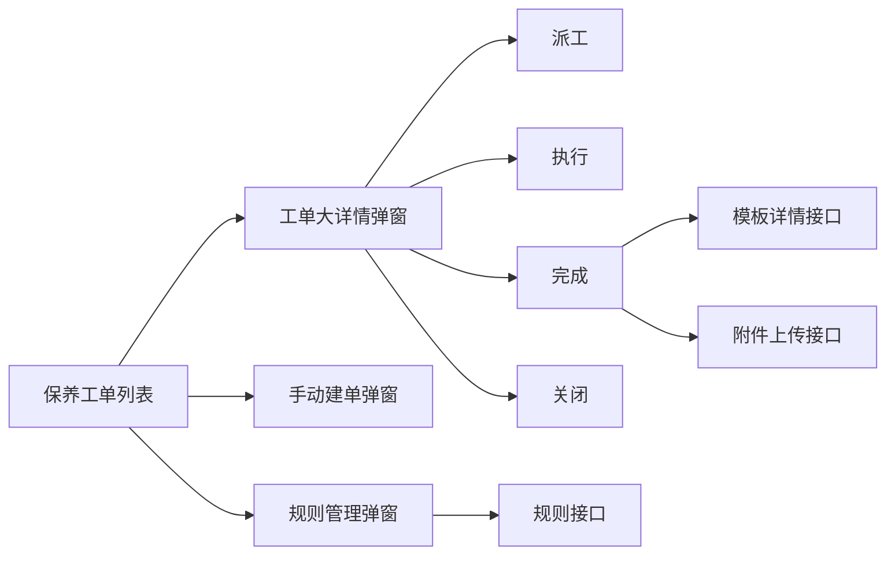

# 保养工单第二阶段收口计划

## 目标

- 以 [src/views/maintain/order.vue](src/views/maintain/order.vue) 为中心，把保养模块从“分页列表 + 占位按钮”升级成可联调的完整闭环。
- 不新增独立“保养计划”路由，继续保留 [src/router/index.ts](src/router/index.ts) 的单入口结构，在当前 `保养工单` 页面内承载规则管理入口。
- 把保养模块权限提前到这一轮，基于登录返回的稳定角色标识控制按钮、动作和提示。

## 现状锚点

- [src/api/maintain.ts](src/api/maintain.ts) 目前只有分页接口，保养模块还没有详情、动作、规则、模板、上传等能力。
- [src/views/maintain/order.vue](src/views/maintain/order.vue) 已有列表筛选与占位动作，但还没有“大详情弹窗 + 动态主动作 + 规则管理弹窗”的承载结构。
- [src/api/auth.ts](src/api/auth.ts) 与 [src/views/login/index.vue](src/views/login/index.vue) 现在只落 `token`，还没有用户资料和角色信息。

```28:31:src/api/maintain.ts
/** GET /api/maintain/order/page（baseURL 已含 /api 时为 /maintain/order/page） */
export function getMaintainOrderPage(params: MaintainOrderPageParams) {
  return request.get<MaintainOrderPageData>('/maintain/order/page', { params })
}
```

```8:15:src/api/auth.ts
export interface LoginResult {
  token: string
}

/** POST /auth/login */
export function login(data: LoginPayload) {
  return request.post<LoginResult>('/auth/login', data)
}
```

## 已锁定的业务边界

- 状态机固定为：`待派工 -> 待执行 -> 执行中 -> 已完成`；仅 `待派工 / 待执行` 可关闭，关闭时必须“原因分类 + 文本说明”。
- 列表操作列保留 `查看 + 按状态动态显示的唯一主动作`；真正的派工、执行、完成、关闭以“大详情弹窗”为主入口。
- 手动建单支持两种模式：`只建单进入待派工`，以及 `建单并派工直接进入待执行`。
- 规则管理继续挂在 `保养工单` 页面内，通过轻量弹窗/入口打开；不单开新页面。
- 生成规则模型采用：`按分类/模板定义规则 + 每台设备按最近一次完成时间滚动`；首次保养基准来自设备启用/投产日期；提前生成天数为全局统一值；若上一张工单未完成，则阻止下一周期继续出单。
- 规则周期先收敛为固定枚举：`每日 / 每周 / 每月 / 每季度 / 每年`；立即生成仅支持“按单条规则触发”。
- 完成记录必须包含：完成结果（`正常完成 / 部分完成 / 异常完成`）+ 备注、模板检查项（模板固定项 + 自定义补充项）、耗材/备件记录（选择现有备件但本轮不联库存）、附件上传（常见文件类型）。
- 检查项结果采用 `正常 / 异常 / 不适用` 的枚举 + 备注；完成与关闭都保留枚举 + 文本说明。
- 模板不纳入这轮管理能力，但模板列表与模板详情都升级为保养模块专用接口；固定检查项必须接真实后端模板/检查项接口，不能用前端静态兜底收尾。
- 权限来源改为“登录即返回稳定角色标识”；角色优先级固定为：`系统管理员 > 保养主管/设备负责人 > 执行人员 > 只读查看`；按钮在“无权限 / 状态不允许”时统一置灰并提示原因。

## 建议实现切片

### 1. 先补认证与权限底座

- 扩展 [src/api/auth.ts](src/api/auth.ts) 的登录返回体，让登录同时返回 `token + 当前用户信息 + 稳定角色标识`。
- 在已有 Pinia 入口 [src/main.ts](src/main.ts) 基础上新增一个轻量认证 store，统一承载当前用户、角色优先级、按钮可用性判断和登出清理。
- 更新 [src/views/login/index.vue](src/views/login/index.vue)、[src/router/index.ts](src/router/index.ts)、[src/layout/index.vue](src/layout/index.vue)，让刷新后仍能恢复角色态，并为保养模块按钮控制提供统一入口。

### 2. 把保养模块 API 和接口约定补齐

- 扩展 [src/api/maintain.ts](src/api/maintain.ts)，至少补齐：工单详情、手动建单、派工、执行、完成、关闭、规则列表、新增/编辑、启停、立即生成、模板列表、模板详情、附件上传。
- 同步更新 [docs/API_CONTRACT.md](docs/API_CONTRACT.md) 和 [docs/前端开发里程碑.md](docs/前端开发里程碑.md)，把这轮已经确定的状态流、枚举、权限来源、规则模型写进文档，避免前后端各自再猜一版。
- 重点把“结果枚举、关闭原因分类、规则阻塞策略、模板检查项结构、附件结构”定义成清晰的前后端契约，而不是放在页面里临时拼装。

### 3. 重构保养工单页为“列表 + 大详情 + 两类入口弹窗”

- 保留 [src/views/maintain/order.vue](src/views/maintain/order.vue) 作为列表页，但把操作模式改成：`查看` 打开大详情；另一个快捷动作按状态动态变化。
- 新增 [src/views/maintain/components/](src/views/maintain/components/) 目录，至少拆出：`MaintainOrderDetailDialog`、`MaintainOrderCreateDialog`、`MaintainRuleDialog`，并在详情弹窗内部承载派工/执行/完成/关闭动作区。
- 详情弹窗最少展示：基础信息、状态时间线、动作留痕、执行/完成记录、备件使用明细、附件列表、规则来源、关闭信息。




### 4. 让规则管理和模板依赖真正可联调

- 规则弹窗只承载“列表 + 新增/编辑 + 启停 + 单条立即生成”，不扩成单独页面。
- 规则字段围绕已定边界收敛：分类/模板、周期枚举、是否启用；首单基准与滚动逻辑由后端按“投产日期 + 最近一次完成时间”实现，前端负责正确表达与解释。
- 模板数据不再只靠字典；页面选择模板时走专用模板接口，进入完成动作时再拉模板检查项详情并允许补充自定义项。

### 5. 用角色权限收口最终交互

- `系统管理员` 与 `保养主管/设备负责人` 拥有保养模块全操作。
- `执行人员` 可查看、管理规则、手动建单、执行、完成，但不能派工和关闭。
- `只读查看` 仅可看列表/详情，并可查看或下载附件。
- 所有按钮统一走角色 + 状态双重判定；不满足条件时禁用并提示原因，避免“按钮突然消失”的理解成本。

### 6. 验收方式

- 先做无后端破坏的静态结构调整，再逐步把 API 接口接进来，避免一次性把 [src/views/maintain/order.vue](src/views/maintain/order.vue) 改到不可运行。
- 代码验收至少覆盖：登录后角色落地、列表筛选分页不回退、查看/快捷动作联动、详情内派工/执行/完成/关闭、规则启停与立即生成、模板检查项加载、附件上传、按钮禁用提示。
- 技术验收最低跑通 `vite build`，并手动串联四条主流程：`规则生成工单`、`手动建单待派工`、`建单并派工待执行`、`执行到完成并查看详情留痕`。

